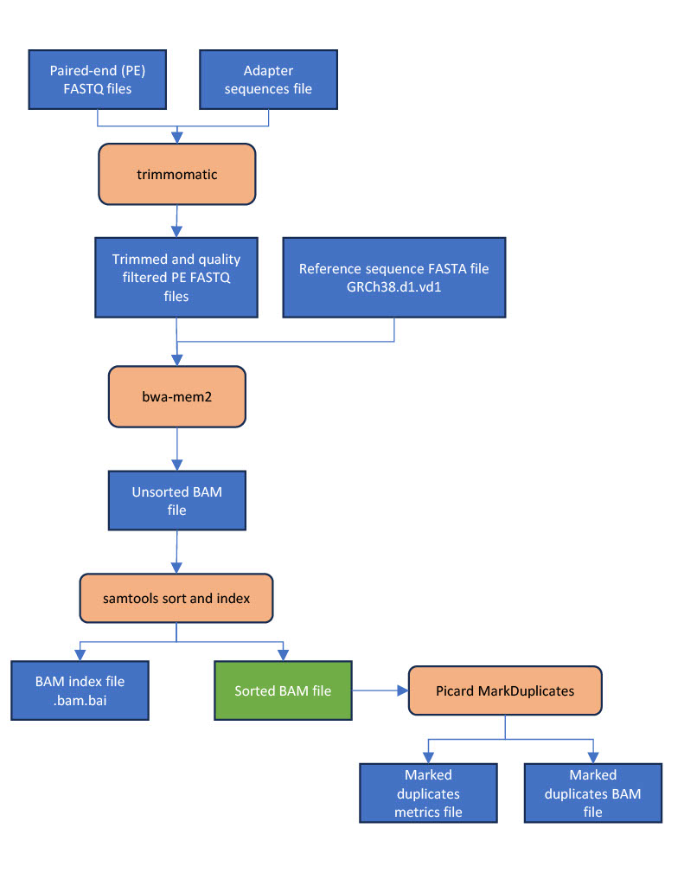

## Alignment Pipeline Outline 

Description of the [WGS nextflow alignment pipeline](https://github.com/ohsu-cedar-comp-hub/WGS-nextflow-workflow) with a comparison to the [GDC pipeline](https://docs.gdc.cancer.gov/Data/Bioinformatics_Pipelines/DNA_Seq_Variant_Calling_Pipeline/).



|Step | Parameter | COH WGS nextflow pipeline | GDC pipeline |
| --- | --------- | ------------------------- | ------------ |
| 0 | Quality filter | Illumina chastity filter + trimmomatic | Illumina chastity filter |
| 0 | Trimming adapters | trimmomatic | NA |
| 0 | Reference genome | GRCh38.d1.vd1 | GRCh38.d1.vd1 |
| 0 | Read groups | -R flag | Aligned separately then merged << Unsure about this section |
| 1 | BWA algorithm | bwa-mem2 | bwa-mem |
| 2 | BAM sort | samtools | picard SortSam |
| 3 | Mark duplicates | picard MarkDuplicates | picard MarkDuplicates |
| 4 | Co-cleaning workflow | NA | gatk RealignerTargetCreator, IndelRealigner, BaseRecalibrator, PrintReads | 

#### 0. Pre-alignment: quality filtering and trimming
See https://github.com/ohsu-cedar-comp-hub/WGS-nextflow-workflow/issues/12 << Replace me with real fastqc readme when completed. After QC, trimmomatic is run in paired-end mode.   
**File input**: Paired end reads (read 1 and read 2) and a file of sequencing adapters used in the library prep (TruSeq3-PE.fa)  
**File output**: Paired end reads (trim read 1 and trim read 2), adapters trimmed and quality filtered  
**Call:**  

```Shell
trimmomatic \
    PE -phred33 \
    ${read1} \
    ${read2} \
    ${read1.baseName}_1P.fastq.gz \
    ${read1.baseName}_1U.fastq.gz \
    ${read2.baseName}_2P.fastq.gz \
    ${read2.baseName}_2U.fastq.gz \
    ILLUMINACLIP:"${truseq3pefile}":2:30:10 LEADING:3 TRAILING:3 SLIDINGWINDOW:4:20 MINLEN:50
```

#### 1. Alignment with Burrows-Wheeler Aligner (BWA) algorithms
 
**File input:** Trimmed, quality filtered, paired-end .fastq files (assigned to variable "read 1" and "read 2" in parameters file).    
**File output:** Aligned .bam file   
**Call:**  
``` Shell
bwa-mem2 mem \
    -K 100000000 -t 6 -Y -M \
    -R "@RG\tID:${params.ID}\tLB:no_library\tPL:illumina\tPU:none\tSM:${trim_read1.baseName}" \
    ${params.idx} ${trim_read1} ${trim_read2} |
    samtools view -Sb -@ 4 > ${trim_read1.baseName}.bam
```
**Comparison GDC call**:  
```Shell
bwa mem \
    -t 8 \
    -T 0 \
    -R <read_group> \
    <reference> \
    <fastq_1.fq.gz> \
    <fastq_2.fq.gz> |
    samtools view \
    -Shb
    -o <output.bam> -
```

#### 2. Sort and index
**File input**: Unsorted BAM file  
**File output**: Sorted and indexed BAM file (.bam file and .bam.bai file)  
**Call**:
```Shell
samtools sort ${bam_unsorted} > ${bam_unsorted.baseName}_sorted_indexed.bam
samtools index ${bam_unsorted.baseName}_sorted_indexed.bam > ${bam_unsorted.baseName}_sorted_indexed.bam.bai
```  

**Comparison GDC call**:   
```Shell
java -jar picard.jar SortSam \
    CREATE_INDEX=true \
    INPUT=<input.bam> \
    OUTPUT=<output.bam> \
    SORT_ORDER=coordinate \
    VALIDATION_STRINGENCY=STRICT
```

#### 3. Mark duplicates
**File input:** Sorted BAM file   
**File output:** BAM file of marked duplicates and a metrics txt file

**Call:**  
```Shell
gatk MarkDuplicates \
    -I ${bam_sorted} \
    -O ${bam_sorted.baseName}_marked_duplicates.bam \
    -M ${bam_sorted.baseName}_marked_duplicates_metrics.txt \
    --VALIDATION_STRINGENCY LENIENT
```  

**Comparison GDC call**:  
```Shell
java -jar picard.jar MarkDuplicates \
    CREATE_INDEX=true \
    INPUT=<input.bam> \
    VALIDATION_STRINGENCY=STRICT
```